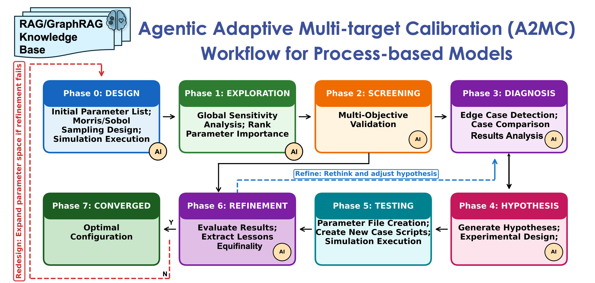

# CLAUDE.md - Context for Claude AI Assistants

**Project:** A2MC (Agentic Adaptive Multi-target Calibration)
**Purpose:** Fully autonomous multi-target calibration of process-based environmental models using AI API + HPC + Adaptive Memory. **This line is the NON-CIME one** (EcoSIM · PFLOTRAN · ATS, via the `models/` adapter registry); the CIME-configured ESMs (ELM, ELM-FATES) are developed in the sibling **[`A2MC-elm`](https://github.com/jingtao-lbl/A2MC-elm/)**. See §"What is A2MC?" below.
**Status:** Implementation Complete (v2.409)
**Last Updated:** September 10, 2026
---


## What is A2MC?

A2MC is an AI-driven calibration framework for process-based environmental models. It combines:

1. **Morris/Sobol sensitivity analysis** - Parameter space exploration
2. **AI API reasoning** - Intelligent diagnosis and hypothesis generation
3. **HPC execution** - Runs on NERSC Perlmutter supercomputer
4. **Adaptive Memory** - Learns from experiments, avoids repeating failures
5. **Multi-objective optimization** - Calibrates several targets simultaneously

### Two lines, split by how the model is BUILT AND RUN

A2MC is released as **two public repositories**, and which one a user wants is decided by their model's build-and-run path, not by which repo sounds newer:

| | [**`A2MC-elm`**](https://github.com/jingtao-lbl/A2MC-elm/) | [**`A2MC`**](https://github.com/jingtao-lbl/A2MC) |
|---|---|---|
| public face of | the `main` line | the `adapter-kit` line |
| **use it for** | **CIME-configured Earth system models** | **models that are not CIME-configured** |
| models today | ELM, ELM-FATES | EcoSIM, PFLOTRAN, ATS |
| a case is built and run by | CIME (`create_newcase` / build / submit) | each model's own backend under `models/<name>/` |
| machine config | `a2mc_config.sh` | `a2mc_noncime_config.sh` |
| adding a model | the built-in FATES path | the `models/` registry + `onboard-model` |
| worked reference case (**developed against**, not shipped) | `ELM-FATES_Kougarok` — and it SHIPS on this line | `EcoSIM_BioCON` — a collaborator case, shipped to nobody |

**The split is structural, not packaging.** The `models/` registry holds **only** non-CIME adapters — there is no `models/fates/` module. FATES reaches the workflow as the **default built-in path** (`registry.py` defaults `A2MC_MODEL` to `"fates"`), served by `tools/evaluate_case.py`, `tools/fates_utils.py` and `tools/create_case.sh`. So the adapter layer is by construction the non-CIME layer.

`A2MC` also **carries the FATES code path**, so it is a superset of A2MC-elm's *framework* by content. It does **not** carry `ELM-FATES_Kougarok`: as of 2026-08-28 the public `A2MC` ships no case study, only `use_cases/TEMPLATE/` and the per-model `*_template` demo cases. The split says where each line's *development effort* goes, not which code is present.

**They converge later, in one direction:** A2MC is intended to serve both, and **[`A2MC-elm`](https://github.com/jingtao-lbl/A2MC-elm/) folds into [`A2MC`](https://github.com/jingtao-lbl/A2MC)**. Until then each is developed to its own strength so neither waits on the other.

---

## One Agent, Two Ways (Online Autonomous + Offline Interactive)

A2MC is **one agent that runs in two runtimes** over the same shared substrate (operating rules, skills, memory, logs, RAG, tools):

- **Autonomous (online) agent** — `python orchestrator.py --run`, the fixed Phase 0→7 state machine calling the model in a loop. Unattended, at scale. Runs its `MemoryManager` in **`propose`** mode (auto-learned lessons staged to `auto_discovered_pending.json`, never written straight to the curated KB).
- **Interactive (offline) agent** — a coding-agent harness (e.g. Claude Code) operating in the repo by conversation — *this is you when working here*. For open-ended, judgment-heavy, one-off work the loop cannot do, and the **sole writer of curated knowledge** (it reviews + promotes the autonomous agent's proposals via `tools/review_pending_knowledge.py`).

The interactive agent's **public-safe, harness-neutral operating contract** is [`AGENTS.md`](AGENTS.md); its capability catalog is `.claude/skills/` (indexed in [`docs/a2mc_reference/skills_catalog.md`](docs/a2mc_reference/skills_catalog.md)). `AGENTS.md` is the shareable distillation; this `CLAUDE.md` is the fuller dev-repo guide (its private regions — clone topology, sync legs, host paths — are stripped on public sync). When working interactively, follow `AGENTS.md` + this file, and **resolve the run mode first** (`python tools/describe_mode.py`) since A2MC is mode-aware (ELM with/without FATES, different FATES API milestones, ECA vs RD). Each skill's `modes:` frontmatter declares where it applies. `AGENTS.md` + `.claude/skills/` ship to the public repo (sync includes them, behind a fatal leak-scan gate); dev logs and internal planning do not (this `CLAUDE.md` ships with its private regions stripped).

---

---

## When documents disagree (this file · skills · memory · code)

Governs **both** the development rules above and the calibration rules below. Written 2026-08-03 after a
day of round-trips: three specs disagreed about one format contract, and fixing them one at a time
introduced a *new* contradiction.

**Two things outrank every document: the evidence, and Jing.**

**Do NOT state which side is right until all five steps are done.** A conclusion drawn at step 2 is a
guess wearing a citation. Report the finding once, at the end, with what it is based on.

1. **Stop, and do not blend the two versions.** Averaging two contradictory rules produces a third rule
   nobody wrote. (Global Rule 5: surface conflicts, don't average them.)
2. **Find EVERY place the contract lives — before editing any of them.** One `grep`, up front. A
   contract is rarely in one file: a rule can live in this `CLAUDE.md`, a `SKILL.md`, the 4-way skill
   registry (`AGENTS.md` · `.claude/skills/README.md` · `docs/a2mc_reference/skills_catalog.md`), a
   format spec under `memory/`, a checker under `tools/`, and an agent memory file. Fixing the one in
   front of you is how a five-file drift becomes five separate corrections.
3. **VERIFY against ground truth. This step decides — not the ranking below.** What does the code
   actually do; what does `git log` / `git show <rev>:<path>` say about which text came later; what does
   the artifact on disk contain? Run it, read it, diff it. **A document is evidence of intent, never
   evidence of fact.** This file included: it is updated by hand and is sometimes stale for exactly that
   reason.
4. **Fix every location in ONE commit.** Piecemeal repair is what lets a fix contradict a spec it did
   not touch.
5. **Bring the evidence to Jing, and let him decide.** Not a summary of the conflict — the verified
   facts, what each source says, and which one the evidence contradicts. He may have decided this
   already and forgotten, or changed his mind since; either way the call is his. **Memory writes are
   human-gated regardless** (`feedback_verify_or_ask_hard_stops`).

**Relative trust — a tie-breaker only, used AFTER step 3 fails to settle it, never instead of it:**

| | Trust | Because |
|---|---|---|
| Code, `git`, the artifact on disk | **ground truth** | not a matter of opinion |
| A `SKILL.md` | above memory | ships with the code, versioned, registry-enforced (`feedback_skill_is_authoritative_over_memory`) |
| **This `CLAUDE.md` — and the agent's memory files** | **the same level as each other** | both are hand-maintained prose that drifts when an update is skipped. Neither automatically beats the other |
| A checker (`tools/check_*.py`) | **not on this ladder** | it is the *enforcement* of a spec, not a third opinion. Checker vs its spec disagreeing is a **bug in one of them** |

## Calibration Rules - for calibrating ELM and ELM-FATES with A2MC

Rules that govern **calibration work**. They apply to **both agents** — the autonomous `orchestrator.py --run` loop and the interactive coding agent. The harness-neutral statement of the same discipline is `AGENTS.md` §"Core operating rules"; keep the two in sync.

1. **NEVER ASSUME — ALWAYS VERIFY** - Do NOT make assumptions about project structure, parameters, or FATES behavior. Read the source of truth (configs, scripts, the FATES knowledge base) before stating what is or isn't included/allowed.
2. **VERIFY FATES BEHAVIOR FIRST** - Never infer a parameter, flag, or mechanism's effect from its name. Query the RAG/GraphRAG knowledge base, `docs/elm-knowledge-base`, and `docs/fates-knowledge-base/` before writing comments, docs, or code that assert how ELM and ELM-FATES works.
3. **READ THE PHASE CONTEXT DOC** - When working in a phase folder, read its `CLAUDE.md` (overview in `phases/CLAUDE.md`) before editing or running there.
4. **NO HARDCODED PATHS** - Machine settings live in `a2mc_config.sh`, site settings in `use_cases/{site}/config/{site}_config.sh`; access them in Python via `tools/config.py`. Source the SITE config before running anything; since v2.306 it auto-sources the machine config, so one command is enough and the explicit machine-config-first form is a no-op.
5. **CHECK EXISTING STRUCTURE** - Verify actual folder/file names by reading existing code or listing directories before writing paths. Never assume folder names (e.g., `data` vs `gained_knowledge`, `logs` vs `phase_results`). See A2MC reference documents in `docs/a2mc_reference`.

---


---

## 7-Phase Workflow

<p align="center">
  
</p>

<p align="center"><sub>The <b>AI</b> badges mark where the <b>online</b> loop calls the AI API. Offline, every phase is agent-driven, Phase 5 included — see the note under the phase table below.</sub></p>

```
   ┌─────────┐   ┌─────────────┐   ┌───────────┐   ┌───────────┐
┌─►│ Phase 0 │──►│   Phase 1   │──►│  Phase 2  │──►│  Phase 3  │◄─┐
│  │ DESIGN  │   │ EXPLORATION │   │ SCREENING │   │ DIAGNOSIS │  │
│  └─────────┘   └─────────────┘   └───────────┘   └─────▲─────┘  │
│                                            skip-test   │        │
│                                            (innermost: │        │
│                                             Phase 3↔4) │        │
│  ┌─────────┐   ┌─────────────┐   ┌───────────┐   ┌─────▼─────┐  │
│  │ Phase 7 │◄Y─│   Phase 6   │◄──│  Phase 5  │◄──│  Phase 4  │  │
│  │CONVERGED│   │ REFINEMENT  │   │  TESTING  │   │HYPOTHESIS │  │
│  └─────────┘   └──┬───────┬──┘   └───────────┘   └───────────┘  │
│                   │       └────── rethink (middle: Phase 6↔3) ──┘
└───────(N)─────────┘
   Redesign (outermost: Phase 6→0): expand parameter space when experiment cycles reach max without meeting all targets

Phase 6, after evaluating experiment results:
   all targets met                        → Phase 7 CONVERGED (terminal)        [Y]
   not met, experiment cycles < max       → Phase 3 (rethink, middle loop)
   not met, experiment cycles reached max → Phase 0 (redesign, outermost loop)  [N]
Inner loop: Phase 3 ↔ Phase 4 (skip-test with existing data, no HPC)
```

| Phase | Name | Purpose | AI API call (online loop)? |
|-------|------|---------|-----|
| 0 | DESIGN | Morris/Sobol sampling, create cases, submit to HPC | Yes |
| 1 | EXPLORATION | Extract Y matrix, run Morris sensitivity analysis | Yes |
| 2 | SCREENING | Rank ensemble by validation targets | Yes |
| 3 | DIAGNOSIS | Root cause analysis, edge case detection | Yes |
| 4 | HYPOTHESIS | Generate testable hypotheses, then design experiments OR test them on existing data | Yes |
| 5 | TESTING | Run designed experiments on HPC | No |
| 6 | REFINEMENT | Evaluate results, extract lessons, check equifinality | Yes |
| 7 | CONVERGED | Final optimal configuration | - |

**What the last column means.** It marks whether the **online** agent (`orchestrator.py --run`) makes an **AI API call** in that phase, which is not the same as whether the phase is AI-driven. **Offline, every phase is agent-driven** — the interactive agent reasons through Phase 5 as much as any other, designing the variants, verifying the parameter files, deciding what to submit and reading the census (`phase5-testing` / `offline-testing-workflow`). Phase 5 is marked "No" only because the online loop reaches it with the experiment already designed in Phase 4, so it executes rather than re-reasons. Same for the "[HPC Wait]" row where one appears: waiting needs no API call, and monitoring it offline is still judgement.

**Key design principle:** No idle waiting within any phase. Each phase completes with a deliverable.

**Iteration paths:**
- **Phase 4 ↔ Phase 3:** Skip testing experiments when existing ensemble simulation results can test the hypothesis (e.g., P mass balance analysis) — inner loop, no new simulations.
- **Phase 6 ↔ Phase 3:** Rethink/adjust the hypothesis and run another experiment cycle when targets are not met **and** experiment cycles are still below the max (middle loop).
- **Phase 6 → Phase 0:** Redesign (expand the parameter space) when experiment cycles **reach the max** without meeting all targets (outermost loop). Phase 7 (CONVERGED) is reserved for true convergence — a terminal state, not on the redesign loop.

**Memory learning (agent-dependent — "online proposes, offline disposes"):** Phase 6 extracts lessons in **both** agents, but they have different write authority over curated Adaptive Memory. The **autonomous (online) agent** runs `MemoryManager` in `propose` mode — its discoveries/experiments are staged to `auto_discovered_pending.json` (gitignored run-state) for review, and it **cannot** write knowledge directly. Only the **interactive (offline) agent** promotes vetted, human-curated proposals into Adaptive Memory (`tools/review_pending_knowledge.py` / the `curate-knowledge` skill) and injects human-originated discoveries (`inject-knowledge`). This write gate keeps unattended runs from contaminating the knowledge base.

**Diagnostic-tool promotion (Phase 3, same propose/dispose split):** the same "online proposes, offline disposes" pattern governs the diagnosis tool library. When no existing tool can test a hypothesis, the agent writes a custom `test_hypothesis()` script into `phases/phase3_diagnosis/generated/` (staging; auto-discovered for the current run only). A vetted, reusable one is then **promoted by the interactive (offline) agent** into the permanent library with `tools/promote_diagnostic_script.py` (`--list` → `--script <name> --dry-run` → promote), which copies it to `phases/phase3_diagnosis/` and registers it in `DIAGNOSTIC_TOOLS_INVENTORY` so future runs auto-discover it. Human-gated — review before committing. Full contract: `phases/phase3_diagnosis/generated/README.md`.

---

## Three-Level Iteration Structure

A2MC uses a three-level iteration structure:

### Calibration Round (Outermost: Phase 0 → 7; redesign loops Phase 6 → 0)

A full calibration cycle from parameter design through convergence:

- **Round 1:** e.g., 138 parameters, 4170 simulations
- **Round 2:** e.g., 162 parameters, 4890 simulations (expanded parameter space)
- Set via `--calibration-round N` CLI argument
- Incremented when redesigning the parameter space (Phase 6 → Phase 0)

### Middle Experiment-cycle Loop: (Diagnosis/Hypothesis/Testing/Refinement cycles within a round, Phase 3 → 4 → 5 → 6 → 3)

Each diagnosis → hypothesis → testing → refinement cycle within a round from phase 3 to 6 and back to 3.
Run HPC experiments to test hypotheses that can't be validated with existing data:

- **Max cycles:** `$A2MC_MAX_EXPERIMENTS` (machine config; CLI override `--max-experiments`)
- **Exit conditions:**
  1. All targets met (CONVERGED)
  2. Experiment cycle limit reached
  3. Max iterations limit reached (backward compatibility)

- **Counter:** `experiment_count`, incremented once per experiment cycle
- Tracks progress within the current calibration round

### Inner Loop: Skip Testing (Phase 3 ↔ 4)

Test hypotheses using existing ensemble data without running new HPC simulations:

- **Max cycles:** `$A2MC_MAX_SKIP_TESTING` (machine config; CLI override `--max-skip-testing`)
- **Exit conditions:**
  1. Hypothesis confidence ≥ `$A2MC_CONFIDENCE_THRESHOLD` (machine config; CLI override `--confidence-threshold`)
  2. Skip testing cycle limit reached
  3. Hypothesis requires new experiments (`test_with_existing=false`)

- **Counter:** `skip_testing_count`, incremented once per skip-testing cycle; resets to 0 when a new experiment cycle begins (Phase 5 entry)
- Tracks progress within the current experiment cycle of the current calibration round

### State Tracking

| Field | Description | When Updated |
|-------|-------------|--------------|
| `calibration_round` | Outermost loop (Phase 0→7) | Set via CLI `--start-round` |
| `experiment_count`  | Middle loop counter | Incremented in Phase 6 when returning to Phase 3 |
| `skip_testing_count` | Inner loop counter | Incremented in Phase 4 skip testing, reset when entering Phase 5 |

### Flow Diagram

```
┌──────────────────────────────────────────────────────────────────────────────┐
│              THREE-LEVEL ITERATION STRUCTURE                                    │
│                                                                                │
│  CALIBRATION ROUND (outermost): Phase 0 → 7 cycle  — counter: calibration_round│
│  e.g., Round 1 = 138 params, Round 2 = 162 params, Round 3 = ...               │
│                                                                                │
│  ┌──────────────────────────────────────────────────────────────────────┐     │
│  │  MIDDLE LOOP: Experiment Cycle (max $A2MC_MAX_EXPERIMENTS) — counter: experiment_count│    │
│  │                                                                        │     │
│  │  ┌──────────────────────────────────────────────────────────────┐     │     │
│  │  │  INNER LOOP: Skip Testing (max $A2MC_MAX_SKIP_TESTING) — counter: skip_testing_count│ │  │
│  │  │                                                              │     │     │
│  │  │    Phase 3 (Diagnosis) ◄─────────────────────┐               │     │     │
│  │  │      │                                        │               │     │     │
│  │  │      ▼                                        │               │     │     │
│  │  │    Phase 4 (Hypothesis)                       │               │     │     │
│  │  │      ├── test_with_existing=true ─────────────┘               │     │     │
│  │  │      │   skip_testing_count++ ; iteration++ (display)          │     │     │
│  │  │      │   EXIT: confidence >= threshold, or skip>=max (config), │    │     │
│  │  │      │         or test_with_existing=false                     │     │     │
│  │  └──────┼───────────────────────────────────────────────────────┘     │     │
│  │         ▼                                                              │     │
│  │    Phase 5 (HPC Testing)  — skip_testing_count = 0 (RESET)             │     │
│  │      │                                                                 │     │
│  │      ▼                                                                 │     │
│  │    Phase 6 (Refinement) — decides:                                     │     │
│  │      ├── targets MET ────────────────────────► Phase 7 (CONVERGED)     │     │
│  │      ├── not met, experiment_count < max ────► Phase 3 (next cycle)    │     │
│  │      │      experiment_count++ ; iteration++ (display)                 │     │
│  │      └── not met, experiment_count = max ────► Phase 0 (redesign)      │     │
│  └──────────────────────────────────────────────────────────────────────┘     │
│                                                                                │
│  When Phase 6 → Phase 0 (redesign): calibration_round++                        │
│                                                                                │
└──────────────────────────────────────────────────────────────────────────────┘
```

**The three loop limits are MACHINE-CONFIG settings, not literals.** `A2MC_MAX_SKIP_TESTING`,
`A2MC_MAX_EXPERIMENTS` and `A2MC_CONFIDENCE_THRESHOLD` are exported by `a2mc_config.sh` (CIME
models) and `a2mc_noncime_config.sh` (non-CIME adapter models) and by **nothing else** — a site or
round config such as `use_cases/<site>/config/<site>_config_r<N>.sh` does not set them, so a session
that sourced only the site config has none of them in its environment. `orchestrator.py:3567-3571`
reads all three as its argparse defaults. Quote the variable rather than a number: on 2026-08-22 the
offline checker and four skill documents each carried their own copy of `10`, agreeing with the
config only by coincidence (v2.282, and the skill sweep the same day).

### CLI Arguments (online agent)

```bash
# Start from screening phase in calibration round 2 (e.g., 162 params)
python orchestrator.py --run --start-phase 2 --start-round 2

# Three-level iteration control
python orchestrator.py --run \
    --start-round 2 \        # Calibration round (outermost loop)
    --max-skip-testing 10 \       # Limit skip testing to 10 cycles
    --max-experiments 10 \        # Limit to 10 full experiment cycles
    --confidence-threshold 0.90  # Exit skip testing at 90% confidence
```

---

## Key Files

| File | Purpose |
|------|---------|
| `orchestrator.py` | Main workflow controller, state machine |
| `reasoning/` | Claude API interface package (base, methods, schemas, prompts) |
| `tools/hpc_utils.py` | HPC utilities: HPCConfig, HPCExecutor, ParameterManager |
| `phases/phase1_exploration/extract_sensitivity_outputs.py` | Extract Y matrix from completed simulations |
| `phases/phase1_exploration/morris_sensitivity_analysis.py` | Run Morris sensitivity analysis with SALib |
| `tools/config.py` | Configuration management |
| `tools/cost_functions.py` | Generic error metrics library |
| `tools/evaluate_case.py` | Shared case evaluation against validation targets (screening + experiments) |
| `tools/optimize_function.py` | Ensemble ranking against targets |
| `tools/create_case.sh` | Create CIME case for ensemble member |
| `tools/submit_ensemble.sh` | Submit ensemble jobs to HPC |
| `tools/diagnose_ensemble_status.py` | Check completion status of ensemble |
| `tools/phase_logger.py` | Standardized Markdown logging to use_cases/{site}/memory/logs/ |
| `tools/workflow_status.py` | Master workflow status tracker |
| `tools/extract_knowledge.py` | AI-powered knowledge extraction from logs |
| `tools/session_report.py` | Collect session artifacts and generate AI-powered session report |
| `tools/reports/generate_presentation.py` | Full pipeline: session logs → AI slides → AI narration → PDF → video |
| `tools/reports/generate_video.py` | PDF + narration JSON → narrated MP4 video |
| `memory/manager.py` | MemoryManager class for persistent knowledge |
| `memory/store.py` | JSON persistence utilities |

---

## A2MC Skills (`.claude/skills/`)

A2MC ships its own project-scoped skills, **tracked in this repo** under `.claude/skills/` (versioned). They encode A2MC domain knowledge — HPC-run procedures, calibration conventions, and knowledge-infrastructure recipes specific to this framework — so they live with the code, not in the user-level `~/.claude/skills/` (which holds cross-project skills not tied to any one project). When invoked via the Skill tool, project skills override user skills of the same name.


These skills are the **interactive (offline) agent's capability catalog** (the offline runtime of "One Agent, Two Ways" above). The interactive agent — a coding-agent harness operating in the repo, co-equal to the autonomous `orchestrator.py --run` loop — runs under the public-safe, harness-neutral operating contract in root `AGENTS.md`, with the full per-skill index at `docs/a2mc_reference/skills_catalog.md`. Each skill's `modes:` frontmatter declares which run configurations it applies to (most are mode-agnostic; the FATES Morris-ensemble analysis skills are `requires_fates: true`).

| Skill | Modes | When to use |
|-------|-------|-------------|
| `a2mc-init` | any | First run in a CLONE: verify checkout + milestone, fork-safe remotes, machine config, then route onward (distinct from `onboard-session`, which resumes an existing setup) |
| `onboard-case` | any | Create a NEW case for an already-onboarded model: interview → research plan → `use_cases/<Model>_<Case>/` from that model's template → param list → Phase 0 |
| `onboard-session` | any | Cold-start: orient at session start or after a compaction/reset |
| `calibration-goal` | any | Run-to-convergence driver — the conductor above the phase skills; drives the offline 7-phase loop to CONVERGED, pausing only at the human gates (docs/43; harness-neutral) |
| `calibration-discipline` | any | Per-cycle/per-round DISCIPLINE checklist (definition-of-done) that keeps a long offline campaign stable — the HABITS layer the driver honors (log+self-document each phase, arm monitors after every launch, validate state, per-cycle report, round summary WITH next-round plan); distinct from `calibration-goal` (loop mechanics) |
| `setup-discipline` | any | Per-STAGE definition-of-done for the setup arc (`a2mc-init` / `onboard-model` / `onboard-case`) — which stage am I in, and is it actually finished or only look finished; the setup-side counterpart of `calibration-discipline`. |
| `curate-knowledge` | any | Review + promote staged Tier-3 knowledge proposals (the write-gate loop) |
| `round-housekeeping` | any | Post-round curation AFTER the gate, before the next Phase 0 — curate the round's verified findings, promote/discard staged proposals, emit the open-questions list, record bound debt, and ASSERT the KB is non-empty. FULLER on convergence |
| `inject-knowledge` | any | Inject a human-originated discovery / parameter / relationship into curated knowledge |
| `port-param-file` | any | Port a calibrated/tuned parameter file across model/API versions — remap PFT identity by functional type, transfer overlapping tuned values (api-31 `.nc` → api-43 `.json` and beyond) |
| `calibration-log` | any | Log interactive calibration/exploration for a site — a PhaseLogger phase log or a free-form session log under `use_cases/{site}/memory/logs/` |
| `diagnose-forensics` | any | Triage ONE anomaly — real or artifact? — then root-cause it (a whole round -> `phase3-diagnosis`) |
| `scientific-analysis` | any | Investigation → figure → ana_log (manuscript-supporting) |
| `markdown-to-pdf` | any | Convert a markdown ana_log/report/note to a shareable PDF or Word doc |
| `literature-review` | any | Cited literature review via `paper-search-mcp` (search→triage→extract→synthesis) — PARAMETER-BOUNDS (published ranges → refine a param-list's `lower`/`upper`) or MANUSCRIPT topic review |
| `plotting` | any | Clean, readable, overlap-free matplotlib figures — verify by viewing the PNG |
| `write-report` | any | Integrated, self-contained report for a zero-context human reader |
| `arm-hpc-monitoring` | any (HPC) | Set up real-time monitoring of an in-flight ensemble at session start (Rule #6) |
| `restart-failed-jobs` | any (HPC) | Restart SLURM jobs that failed mid-run or at end-of-run (infra vs model failure) |
| `restart-adapter-ensemble` | any (HPC) | Recover failed cases in a NON-CIME adapter ensemble (EcoSIM/PFLOTRAN/ATS) — classify why they died, persist the case list, relaunch only what is missing |
| `pflotran-run-workflow` | any | Run + test PFLOTRAN (deck-driven) — deck-as-parameter-file, case assembly, `*-mas.dat` scoring, the 806-hour observation offset |
| `ats-run-workflow` | any | Run + test ATS (XML-deck) — ParameterList-by-path, targets in the deck's `observations` block, honest about the v0.1 run wiring |
| `build-rag-from-scratch` | any | Build the RAG/GraphRAG layer from scratch (new model or full reconstruction) |
| `rebuild-rag` | any | Rebuild/repair a model's RAG index — **one build script per model** (FATES/EcoSIM/PFLOTRAN), reindex, wiki bump, and how to actually COMMIT it |
| `wire-knowledge-graph` | any | Audit/fix WHICH curated relations reach a model's knowledge graph — one `build_graph()` per model reading its own seed field names, and a field nothing reads fails silently |
| `generate-codebase-wiki` | any | Produce a source-grounded codebase wiki for a model |
| `validate-rag-chain` | any | Validate the source → wiki → curated-YAML → RAG chain before shipping |
| `add-skill` | any | Scaffold + register a new skill (4-way registry parity) |
| `refine-skill` | any | Refine an existing skill from accumulated evidence (human-gated) |
| `summarize-calibration-round` | any | Single-round summary: ensemble graphs + evaluation + sensitivity + the round's MECHANISM inventory → report |
| `compare-calibration-rounds` | any | Cross-round PARAMETER and MECHANISM ledgers (R1…RN) + performance/sensitivity overlays; required from R1 |
| `offline-testing-workflow` | FATES | Design + launch + analyze a parameter-sweep HPC experiment (V0 reproducibility gate → KB injection) |
| `add-fates-parameter` | FATES | Model-evolution — wire a new FATES parameter into EDParamsMod + the parameter file (experiment branch, default-off, V0-at-equality) |
| `model-evolution` | any | Model-evolution umbrella — the workflow for evolving ANY onboarded model's source, ELM/FATES · EcoSIM · PFLOTRAN · ATS (branch, preserve the baseline binary, default-off, paired verify, fork-only push) |
| `phase0-design` | any | Offline Phase 0 — sample/materialize/submit + monitor the ensemble |
| `phase1-exploration` | any | Offline Phase 1 — extract Y matrix + Morris sensitivity, interpret μ* |
| `phase2-screening` | any | Offline Phase 2 — rank the ensemble vs validation targets |
| `phase3-diagnosis` | any | Offline Phase 3 — root-cause the round's failing targets (HITL analog of `reasoning.diagnose()`) |
| `phase4-hypothesis` | any | Offline Phase 4 — hypotheses + skip-test on existing Morris data (3↔4, no HPC) |
| `phase5-testing` | any | Offline Phase 5 — run HPC experiments (routes to `offline-testing-workflow`) |
| `phase6-refinement` | any | Offline Phase 6 — evaluate, extract lessons, write/promote curated Memory, converge/iterate |

---

## Project Structure

```
A2MC/
├── README.md              # Full user documentation
├── CLAUDE.md              # This file - AI assistant context
├── a2mc_config.sh         # Machine-level config (auto-activates ~/a2mc_env)
├── orchestrator.py        # Main workflow controller
├── reasoning/             # Claude API interface (package)
│   ├── __init__.py        # Backward-compatible re-exports, method attachment
│   ├── schemas.py         # Diagnosis, Hypothesis, Experiment dataclasses
│   ├── prompts.py         # DIAGNOSTIC_TOOLS_INVENTORY, CUSTOM_SCRIPT_TEMPLATE
│   ├── base.py            # ReasoningModule class core (init, query, RAG)
│   └── methods.py         # 8 phase methods (diagnose, hypothesis, etc.)
│
├── use_cases/             # Site-specific case studies
│   ├── README.md          # Overview and instructions
│   ├── TEMPLATE/          # Template for new sites
│   └── Kougarok/          # Kougarok, Alaska (NGEE-Arctic)
│       ├── README.md      # Site description and discoveries
│       ├── config/
│       │   └── kougarok_config.sh  # ALL site-specific settings
│       ├── parameters/
│       │   ├── FATES_Parameter_List_Full_162_Finalized.txt
│       │   └── salib_problem_162params.txt
│       ├── validation/
│       │   └── validation_targets_leafroot.txt
│       └── memory/        # SITE-SPECIFIC KNOWLEDGE
│           ├── logs/      # Phase execution logs (Markdown)
│           ├── extracted/ # Extracted lessons (YAML)
│           └── gained_knowledge/  # Site-specific knowledge (JSON)
│
├── phases/                # Phase-specific scripts
│   ├── CLAUDE.md          # Phase overview for AI assistants
│   ├── phase0_design/     # Morris sampling, case creation
│   ├── phase1_exploration/# Sensitivity analysis (wired to orchestrator)
│   │   ├── extract_sensitivity_outputs.py
│   │   └── morris_sensitivity_analysis.py
│   ├── phase2_screening/  # Ensemble ranking
│   ├── phase3_diagnosis/  # Root cause analysis
│   ├── phase4_hypothesis/ # Hypothesis generation
│   ├── phase5_testing/    # Run experiments
│   └── phase6_refinement/ # Learn from results
│
├── tools/                 # Shared utilities
│   ├── config.py          # Python config loader (reads a2mc_config.sh)
│   ├── phase_logger.py    # Site-specific Markdown logging
│   ├── workflow_status.py # Master workflow status
│   ├── cost_functions.py  # Error metrics (RE, RMSE, NSE, KGE)
│   ├── optimize_function.py  # Ensemble ranking
│   ├── fates_utils.py     # FATES data utilities
│   ├── hpc_utils.py       # HPCConfig, HPCExecutor, ParameterManager
│   ├── modify_fates_parameters.py
│   ├── diagnose_ensemble_status.py
│   └── extract_knowledge.py  # Knowledge extraction from logs
│
├── memory/                # GENERIC KNOWLEDGE (framework-level)
│   ├── __init__.py        # Package exports
│   ├── store.py           # JSON persistence utilities
│   ├── manager.py         # MemoryManager class
│   ├── gained_knowledge/  # Generic FATES knowledge (JSON)
│   │   ├── discoveries.json
│   │   ├── experiments.json
│   │   ├── parameters.json
│   │   └── failed_approaches.json
│   ├── extracted/         # Generic extracted lessons (YAML)
│   └── workflow_log.json  # Master workflow status
│
├── rag/                   # RAG/GraphRAG System
│   ├── loader.py, vector_store.py, knowledge_graph.py
│   ├── graph_builder.py, hybrid_retriever.py
│   ├── parameter_parser.py, output_parser.py
│   ├── data/
│   │   └── curated_relationships.yaml  # Curated mechanistic relationships
│   └── chroma_db/         # Vector index
│
├── templates/             # AI output & documentation templates
│   ├── reasoning/         # JSON schemas for AI output structure
│   └── logging/           # Markdown templates for reasoning documentation
│
├── docs/                  # Documentation
│   ├── A2MC_System_Master_Plan.md
│   ├── a2mc_reference/    # Detailed reference docs (extracted from CLAUDE.md)
│   │   ├── rag_reference.md         # RAG/GraphRAG system details
│   │   ├── fates_data_reference.md  # FATES dimensions, PFTs, SZPF, units
│   │   └── tools_reference.md       # Tool APIs: logger, status, config, ensemble
│   ├── 00-11_*.md         # Implementation plan docs
│   └── fates-knowledge-base/  # FATES documentation (official + wiki)
│
├── scripts/               # Utility scripts
│   ├── seed_memory_from_yaml.py
│   ├── build_rag_index.py
│   └── curated_knowledge_template.yaml
│
├── plot/                  # Visualization scripts
│   └── visualize_a2mc_horizontal.py
│
└── tools/reports/         # Offline presentation pipeline
    ├── WORKFLOW.md        # Full workflow documentation
    ├── generate_presentation.py  # Automated: logs → slides → narration → PDF → video
    ├── generate_video.py  # PDF + narration JSON → narrated MP4
    └── examples/          # Reference examples
```

**Each phase folder contains:**
- `CLAUDE.md` - Context for AI when working in that phase
- `__init__.py` - Python package marker
- Phase-specific scripts

---

## Adaptive Memory System

**THREE LAYERS** (PI, 2026-09-06). This section said "two-tier" until then and named the first layer "Generic Knowledge (Framework-level) … applies to all sites", which is wrong twice over: the model layer was missing entirely, and the store it called generic is FATES-only.

| layer | path | holds |
|---|---|---|
| **1. Claude memory bucket** | `.claude_memory/` (dev repo only, never synced) | how the agent works — process rules, references, user facts — **and model-scoped notes**: 18 of its files carry `scope: fates / ecosim / elm / elm-fates` |
| **2. model** | `memory/gained_knowledge/` (**FATES**), `memory/ecosim/gained_knowledge/`, `memory/pflotran/gained_knowledge/` | true of that model wherever it runs, on any site |
| **3. model-case** | `use_cases/{Model}_{Case}/memory/gained_knowledge/` | true of THIS case: its clock, its data, its deck, its targets |

**The default is the narrowest layer that holds the finding.** Layers 2 and 3 are the JSON knowledge stores below; layer 1 is documented in `.claude_memory/CLAUDE.md`.

### Model Knowledge — FATES

Located at `memory/gained_knowledge/`. Despite the unprefixed path this is the **FATES** store, not a framework-generic one; the adapter models have their own at `memory/<model>/gained_knowledge/`:

| Store | Purpose |
|-------|---------|
| `discoveries.json` | General FATES mechanistic insights |
| `experiments.json` | Generic experiment patterns |
| `parameters.json` | Parameter knowledge (not site-specific) |
| `failed_approaches.json` | Generic approaches to NOT repeat |

### Site-Specific Knowledge

Located at `use_cases/{site}/memory/gained_knowledge/`:

| Store | Purpose |
|-------|---------|
| `discoveries.json` | Site-specific mechanistic insights (e.g., "Kougarok Allocation Paradox") |
| `experiments.json` | Site experiments with outcomes |
| `failed_approaches.json` | Site-specific approaches to NOT repeat |

### Other Memory Locations

| Location | Purpose |
|----------|---------|
| `memory/workflow_log.json` | Master workflow status (current phase, history) |
| `memory/extracted/` | Generic extracted lessons (YAML) |
| `use_cases/{site}/memory/logs/{session_id}/` | Phase **execution** logs with AI reasoning (session-scoped, Markdown) |
| `use_cases/{site}/memory/extracted/` | Site-specific extracted lessons (YAML) |

### Knowledge Promotion

**A curated discovery lands in its own case's store. It is not promoted anywhere by default** (PI, 2026-09-06):

```
Run/agent discovery → human review gate → Copy to use_cases/{Model}_{Case}/memory/gained_knowledge/
```

**Promotion UP to the model layer is a separate, evidence-gated step**, and the destination is that case's own model — `memory/ecosim/gained_knowledge/`, `memory/pflotran/gained_knowledge/`, or `memory/gained_knowledge/` **for FATES only**. One site showing a pattern is one observation, not evidence the pattern generalizes.

> **`memory/gained_knowledge/` is the FATES store, not a generic one.** All 12 of its discoveries name `fates_cnp_*`, `FATES_L2FR` or ELM variables and its one failed approach is `SUPLPHOS=ALL during TRANSIENT`. It is unprefixed because FATES is A2MC's built-in path rather than an adapter under `models/`, so it occupies the slot from before the model layer existed. **Copying a non-FATES case's discovery there is a cross-model misroute**, and `tools/promote_knowledge.py` still hardcodes it as `GENERIC` — an open defect, harmless only because that tool has never run on a real promotion.
### Session Logging Convention

**Phase Execution logs** (outputs from A2MC runs, session-scoped):
```
{session_id}/phase0_design/   r{RR}_{session_id}_Title.md
{session_id}/phase3_diagnosis/ r{RR}_c{EE}_iter{II}_{session_id}_Title.md
{session_id}/phase5_testing/   r{RR}_c{EE}_{session_id}_Title.md
```
- Logs are stored under `use_cases/{site}/memory/logs/{session_id}/phase{N}_{name}/`
- `RR` = calibration_round (outermost Phase 0→7 loop, e.g., round 1=138 params, round 2=162 params)
- `EE` = experiment_count (middle loop: full 3→4→5→6 experiment cycles)
- `II` = iteration (Phase 3&4 only: skip_testing_count+1, inner loop counter)
- `session_id` = `YYYYMMDD_HHMMSS` timestamp matching the run log (`a2mc_run_{session_id}.log`)
- Phases 0-2 omit cycle/iteration (always 1, not meaningful)
- Phases 5&6 omit iteration (only one Phase 5 and one Phase 6 per experiment cycle)
- Example: `20260210_143052/phase2_screening/r02_20260210_143052_Ensemble_Screening.md`
- Example: `20260210_143052/phase3_diagnosis/r02_c01_iter03_20260210_143052_PFT10_Analysis.md`
- Fallback (no session_id): logs go directly under `phase{N}_{name}/` without session subdirectory

**Key API:**
```python
from memory import MemoryManager

# Generic knowledge
memory = MemoryManager("memory/gained_knowledge")

# Site-specific knowledge
memory = MemoryManager("use_cases/ELM-FATES_Kougarok/memory/gained_knowledge")

# NOTE: there is NO `phase=` kwarg — passing one raises TypeError. Real signature:
#   get_relevant_context(failing_targets=None, max_chars=8000, targets=None,
#                        parameters=None, verified_only=False) -> str
memory.get_relevant_context(targets=..., parameters=...)
memory.add_discovery(name, description, mechanism, affects, confidence)
memory.add_failed_approach(approach, experiment_id, why_failed, severity)
```

---

## Templates

Templates define structure for AI outputs and documentation:

```
templates/
├── reasoning/                 # AI output structure (JSON schemas + Markdown)
│   ├── README.md
│   ├── phase3_diagnosis_template.md    # Root cause analysis output
│   ├── phase4_hypothesis_template.md   # Hypothesis generation output
│   └── phase6_refinement_template.md   # Lesson extraction output
│
└── logging/                   # AI reasoning documentation (Markdown)
    ├── README.md
    ├── diagnostic_log_template.md      # Phase 3 deep dives
    ├── experiment_log_template.md      # Phase 4-5 experiments
    ├── discovery_log_template.md       # Key findings ("Perfect Storm", etc.)
    └── analysis_log_template.md        # General analysis
```

### Reasoning vs Logging Templates

| Aspect | Reasoning Templates | Logging Templates |
|--------|--------------------|--------------------|
| **Purpose** | Define AI output structure | Document reasoning process |
| **Format** | JSON schemas + sections | Markdown narratives |
| **Audience** | Programmatic parsing | Human readers + future AI |
| **Storage** | In-memory / API response | `use_cases/{site}/memory/logs/` |

**Reasoning templates** define WHAT to output (used by `reasoning/methods.py`).
**Logging templates** define HOW to document (for persistent memory).

### Key Patterns from Offline Iteration

Templates incorporate patterns from the first calibration iteration:

| Pattern | Description | Template |
|---------|-------------|----------|
| "Perfect Storm" | Multi-factor cascading failures | `discovery_log_template.md` |
| "Allocation Paradox" | Counter-intuitive allocation behavior | `experiment_log_template.md` |
| "Triple Bottleneck" | Multiple simultaneous constraints | `diagnostic_log_template.md` |
| Mortality Analysis | Hydraulic vs C starvation decomposition | All templates |
| Cross-PFT Comparison | Differential PFT responses | All templates |

### Phenology-Nutrient Uptake Interaction

Key mechanistic insight encoded in templates:
- **Evergreen PFTs (PFT7)**: Persistent but LOW nutrient uptake → vulnerable to chronic stress
- **Deciduous/Graminoid PFTs (PFT9/10)**: HIGH uptake during spring flushing → more resilient

---

## Three-Tier FATES Knowledge System

A2MC uses a three-tier architecture for FATES knowledge:

| Tier | Location | Format | Purpose |
|------|----------|--------|---------|
| **Static Documentation** | `docs/fates-knowledge-base/` | Markdown | Human reference, RAG indexing |
| **RAG/GraphRAG** | `rag/` | ChromaDB + JSON graph | AI semantic search, graph traversal |
| **Adaptive Memory** | `memory/gained_knowledge/` | JSON | AI reasoning context, learned discoveries |

**Key principle:** Same knowledge encoded in all three tiers ensures consistent AI access via multiple retrieval paths.

---

## RAG/GraphRAG System

Hybrid retrieval combining ChromaDB vector search and a NetworkX knowledge graph over per-milestone FATES + ELM source documentation. Two RAG profiles are registered: canonical **`api-43-1`** (6,328 chunks, 3,178 graph nodes, 2,772 edges; FATES `e027a40` / ELM `d40b843`) and legacy **`api-31-0`** (2,581 chunks, 1,295 nodes, 2,197 edges; FATES `e85d997` / ELM `60d9aad`, frozen for the Kougarok manuscript). The `ReasoningModule` automatically queries the active profile's RAG before each Claude API call, combining RAG context + Adaptive Memory + task data. 

**Key concepts:** Two-layer graph (auto-extracted CDL + curated YAML overlay), Python 3.10 required for RAG ops, `HybridRetriever.get_targeted_context()` for efficient per-call context.

**Diagnostic tools:** Any `test_*.py` script with `test_hypothesis()` in `phases/phase3_diagnosis/` is auto-discovered. Claude can also generate custom scripts stored in `phases/phase3_diagnosis/generated/`.

**Full details:** `docs/a2mc_reference/rag_reference.md` (running-system overview)
---

## Validation Targets & Case Studies

Validation targets and site-specific discoveries are documented in `use_cases/`:

| Use Case | Location | Description |
|----------|----------|-------------|
| `use_cases/ELM-FATES_Kougarok/` | Alaska, USA | Arctic tundra, 3 PFTs, NGEE-Arctic |
| `use_cases/TEMPLATE/` | - | Template for new sites |

**See `use_cases/{site}/README.md` for:**
- Site-specific validation targets (biomass, fluxes, etc.)
- Key discoveries and mechanistic insights
- Morris ensemble configuration
- Data locations

### Referencing Knowledge from Similar Sites

When calibrating a new site, you can reference knowledge from existing sites with similar characteristics:

| Your Site Type | Reference | Key Transferable Knowledge |
|----------------|-----------|---------------------------|
| Arctic/tundra | `use_cases/ELM-FATES_Kougarok/` | Allocation Paradox, P-limitation, graminoid-shrub competition |
| CNP-enabled | `use_cases/ELM-FATES_Kougarok/` | PID controller behavior, ECA competition, vmax calibration |

**What transfers:** Mechanistic insights, diagnostic patterns, failed approaches
**What doesn't transfer:** Exact parameter values (site-specific)

```python
# Reference another site's knowledge
from memory import MemoryManager
ref_memory = MemoryManager("use_cases/ELM-FATES_Kougarok/memory/gained_knowledge")
discoveries = ref_memory.get_relevant_context(targets=your_targets)  # no `phase=` kwarg
```

---

## Tools Reference

Detailed documentation for A2MC tools: cost functions, phase logger, workflow status, knowledge extraction, screening analysis, ensemble management, and AI configuration.

**Phase log filenames:** Stored under `logs/{session_id}/phase{N}_{name}/`. Phase 3&4: `r{RR}_c{EE}_iter{II}_{session_id}_Title.md`; Phase 5&6: `r{RR}_c{EE}_{session_id}_Title.md` — session_id = `YYYYMMDD_HHMMSS` matching the run log.

**Workflow status:** `python tools/workflow_status.py` for quick status check.

**Configuration:** Two-level — `a2mc_config.sh` (machine) + `use_cases/{site}/config/{site}_config.sh` (site). Case name pattern: `A2MC_CASE_NAME_PATTERN` with `{N}` and `{PHASE}` placeholders.

**AI config:** Set `A2MC_AI_PROVIDER` to `anthropic` (default), `openai`, or `cborg` (LBL proxy). Each provider auto-derives its API key env var (`ANTHROPIC_API_KEY`, `OPENAI_API_KEY`, `CBORG_API_KEY`). Override with `A2MC_AI_API_KEY_ENV`. Model defaults to `claude-opus-4-20250514`. CBorg uses the OpenAI SDK and auto-sets base URL to `https://api.cborg.lbl.gov`. See `a2mc_config.sh` for all settings.

**Full details:** `docs/a2mc_reference/tools_reference.md`

---

## Running A2MC (the online agent)

### Command Line Usage

```bash
# IMPORTANT: Always source the config first!
# Since v2.306 the site config auto-sources its machine config (a2mc_config.sh for CIME/ELM-FATES,
# a2mc_noncime_config.sh for the adapter models), so this ONE line is enough. Sourcing the machine
# config first still works and is a no-op.
source use_cases/ELM-FATES_Kougarok/config/kougarok_config.sh

# Run workflow (output-dir and state-file auto-detected from config)
python orchestrator.py --run

# Resume from checkpoint (state-file auto-detected)
python orchestrator.py --resume

# Start from specific phase (flexible argument: number, "phaseN", or name)
python orchestrator.py --run --start-phase 1
python orchestrator.py --run --start-phase phase1
python orchestrator.py --run --start-phase exploration

# Start from specific phase in calibration round 2 (e.g., 162 params)
python orchestrator.py --run --start-phase diagnosis --start-round 2

# Run without human review checkpoints
python orchestrator.py --run --no-review

# Skip experiment script generation/review before HPC submission
python orchestrator.py --run --no-script-review

# Run without AI reasoning (rule-based fallback)
python orchestrator.py --run --no-reasoning
```

### Switching AI Providers

Set `A2MC_AI_PROVIDER` in `a2mc_config.sh`. Model and API key env var auto-derive from provider — only the provider needs to change:

```bash
# Option 1: Direct Anthropic (default — no changes needed)
export A2MC_AI_PROVIDER="anthropic"
# → model: claude-opus-4-20250514, key: ANTHROPIC_API_KEY

# Option 2: Direct OpenAI
export A2MC_AI_PROVIDER="openai"
# → model: gpt-4o, key: OPENAI_API_KEY

# Option 3: CBorg (Berkeley Lab proxy)
export A2MC_AI_PROVIDER="cborg"
# → model: anthropic/claude-sonnet, key: CBORG_API_KEY
```

| Provider | SDK | Default Model | Other Models | Base URL | API Key Env |
|----------|-----|---------------|--------------|----------|-------------|
| `anthropic` | `anthropic` | `claude-opus-4-20250514` | `claude-sonnet-4-20250514`, `claude-haiku-3-20240307` | `api.anthropic.com` | `ANTHROPIC_API_KEY` |
| `openai` | `openai` | `gpt-4o` | `gpt-4o-mini`, `o3-mini` | `api.openai.com` | `OPENAI_API_KEY` |
| `cborg` | `openai` | `anthropic/claude-sonnet` | `openai/gpt-4o`, `openai/gpt-4o-mini`, `lbl/llama` | `api.cborg.lbl.gov` | `CBORG_API_KEY` |

### Phase 1 High-Level APIs

```python
from phases.phase1_exploration import run_extraction, run_sensitivity_analysis

# Extract Y matrix from completed simulations
run_extraction(
    case_list="completed_cases.txt",
    output_dir="extracted_data/",
    variables=["FATES_LEAFC", "FATES_FROOTC", "FATES_VEGC_ABOVEGROUND"]
)

# Run Morris sensitivity analysis
run_sensitivity_analysis(
    y_matrix_file="MorrisLeafBiomass.txt",
    problem_file="salib_problem.txt",
    output_dir="sensitivity_results/"
)
```

### Python API

```python
# Note: Source the config first before running Python (it auto-sources the machine config)
# source use_cases/ELM-FATES_Kougarok/config/kougarok_config.sh

from orchestrator import CalibrationOrchestrator, Config

# Config auto-detects output_dir from A2MC_USE_CASE_DIR
config = Config(
    use_memory=True,
    use_reasoning=True,
    max_iterations=10
)
orch = CalibrationOrchestrator(config)
orch.run()
```

### Required Environment Variables

A2MC requires several environment variables to be set before any orchestrator or RAG-aware module is imported. Set these in your site config (`use_cases/<site>/config/<site>_config.sh`) or shell environment:

| Variable | Required? | Purpose |
|----------|-----------|---------|
| `A2MC_MODEL_PATH` | **Yes (hard error if unset)** | Absolute path to user's E3SM / ELM-FATES checkout root. Used by the orchestrator alignment hook to detect the user's FATES + ELM commits and select the matching RAG profile from `rag/milestones.json`. |
| `A2MC_RAG_DIR` | No (default `<repo>/rag`) | RAG storage tree root |
| `A2MC_RAG_ACTIVE` | No (auto-set by orchestrator) | Active milestone profile name (e.g., `api-43-1`); the orchestrator's `_check_rag_alignment()` sets this from the milestone match. Override only for ad-hoc experimentation. |
| `A2MC_RAG_AUTO_REBUILD` | No (default `false`) | If `true`, orchestrator auto-rebuilds on drift (T2 / T3-near only — T1 always auto, T3-distant always manual). If `false`, warns and continues. See docs/22 §3.1. |
| `A2MC_RAG_T3_AUTO_DISTANCE` | No (default `100`) | Maximum FATES api-epoch distance to auto-rebuild for T3 drift. Distance formula: `\|major_a-major_b\|*100 + \|minor_a-minor_b\|`. Above this, orchestrator emits prompt-pack and aborts even with `A2MC_RAG_AUTO_REBUILD=true`. |
| `A2MC_AI_PROVIDER` | No (default `anthropic`) | AI provider for reasoning calls; see `a2mc_config.sh` |
| `ANTHROPIC_API_KEY` / `OPENAI_API_KEY` / `CBORG_API_KEY` | Yes (one of, depending on `A2MC_AI_PROVIDER`) | API key for the chosen provider |

Sourcing `a2mc_config.sh` + `use_cases/<site>/config/<site>_config.sh` sets the values; see `docs/a2mc_reference/version_association_workflow.md` for the milestone-tier workflow.

---

## Documentation

### A2MC Framework Reference
- `docs/a2mc_reference/rag_build_roadmap.md` - **RAG/GraphRAG from-scratch reconstruction guide** (read this for wiki commit bumps or new-model adoption)
- `docs/a2mc_reference/codebase_wiki_generation_roadmap.md` - Adapter-kit Step 1: produce a source-grounded codebase wiki (Workflow A greenfield + Workflow B audit-and-rewrite)
- `docs/a2mc_reference/graphrag_curated_yaml_roadmap.md` - Adapter-kit Step 3: overlay calibration intelligence via the curated YAML (5-phase methodology + AI-assisted bootstrap recipes G1–G4)
- `docs/a2mc_reference/rag_validation_workflow.md` - **Adapter-kit Step 4: validate the chain before shipping** (3-tier validation triangle + step-by-step playbook for `codebase_wiki_validator.py`, `yaml_wiki_validator.py`, `rag_diff.py`)
- `docs/a2mc_reference/version_association_workflow.md` - **Adapter-kit Step 5: associate users' checkouts with the right RAG profile** (milestone registry, auto-detection, T1/T2/T3 bump tiers)
- `README.md` - Full user documentation and API reference

### FATES Knowledge Base
- `docs/fates-knowledge-base/` - Combined FATES documentation
  - `fates-official-docs/` - Official tech docs (RST, equations, theory)
  - `fates-codebase-wiki/` - Code-level wiki (Markdown, 348 diagrams)
- Key sections for calibration:
  - **`fates-codebase-wiki/advanced/cnp_calibration_guide.md`** - **START HERE** for CNP calibration (Knox 2026)
  - `fates-codebase-wiki/plant-physiology/parteh/cnp_allocation.md` - PID controller, three-phase allocation
  - `fates-codebase-wiki/advanced/nutrient_competition.md` - ECA vs RD modes, prescribed vs coupled uptake
  - `fates-codebase-wiki/plant-physiology/parteh/soil_plant_interface.md` - Nutrient uptake mechanics
  - `fates-official-docs/docs/source/parteh/` - PARTEH equations

### Adaptive Memory (`memory/gained_knowledge/`)
- `discoveries.json` - 11 actionable discoveries from Knox 2026 CNP Guidebook + A2MC experience
- `experiments.json` - Experiment records with outcomes
- `parameters.json` - Parameter knowledge (bounds, sensitivities)
- `failed_approaches.json` - Approaches to NOT repeat

---

## CRITICAL: Never Make Assumptions - Always Check RAG/GraphRAG and knowledge base First

**Before writing comments, documentation, or code that describes FATES behavior:**

1. **NEVER assume** what a parameter, flag, or mechanism does based on its name
2. **ALWAYS query the RAG knowledge base** to verify technical details
3. **Check the FATES documentation** in `docs/fates-knowledge-base/`

**How to query RAG:**
```bash
# Use Python 3.10 for RAG operations
/Library/Frameworks/Python.framework/Versions/3.10/bin/python3 -c "
from rag import HybridRetriever
retriever = HybridRetriever(auto_build=False)
# Use available methods: get_parameter_info, get_mechanism_info, get_context, etc.
"
```

**Or search the knowledge base directly:**
```bash
grep -r "use_fates_nocomp" docs/fates-knowledge-base/
```

**Example of what NOT to do:**
- ❌ Assumed `use_fates_nocomp` meant "fixed PFT areas" based on name
- ✅ Should have checked `docs/fates-knowledge-base/fates-codebase-wiki/advanced/simulation_modes.md`
- ✅ Correct: `use_fates_nocomp` means no competition and separates PFTs into patches (no inter-PFT competition), but does NOT fix areas

**Key documentation locations:**
- `docs/fates-knowledge-base/fates-codebase-wiki/` - Code-level wiki with detailed explanations
- `docs/fates-knowledge-base/fates-official-docs/` - Official FATES technical documentation
- `rag/data/curated_relationships.yaml` - Parameter-mechanism-output relationships

---
---


---

**The goal:** Users studying a different Arctic site (or any ELM-FATES application) should be able to:
1. Clone A2MC
2. Configure their site-specific settings
3. Seed their own initial knowledge
4. Run the calibration workflow

**Use the `use_cases/` folder for site-specific documentation:**
- `use_cases/TEMPLATE/` - Template for new case studies
- `use_cases/ELM-FATES_Kougarok/` - Kougarok, Alaska example (NGEE-Arctic)
- Create your own: `use_cases/YourSite/`

---

## Related Resources

- **Public Repository:** https://github.com/jingtao-lbl/A2MC-elm
- **Zenodo DOI:** Tao, J. (2026). A2MC: Agentic Adaptive Multi-Target Calibration. Zenodo software release. Autonomous 7-phase calibration framework for E3SM Land Model (ELM) combining LLM reasoning, curated knowledge base, hybrid RAG/GraphRAG retrieval, and persistent adaptive memory. Available from: https://github.com/jingtao-lbl/A2MC-elm. (https://doi.org/10.5281/zenodo.19194999)


### Upstream Model Repositories (always query these for commits, tags, or source — never guess)

| Repo | URL | Role |
|---|---|---|
| **E3SM** | https://github.com/E3SM-Project/E3SM | Host Earth system model. ELM lives at `components/elm/`. |
| **FATES standalone** | https://github.com/NGEET/fates/ | Authoritative FATES source and tag history. Read tags, release notes, source files here. |
| **FATES-users-guide** | https://github.com/NGEET/fates-users-guide | User/developer documentation. Holds the FATES-HLM compatibility table and the Tagging Methodology. |

**FATES inside E3SM:** `E3SM/components/elm/src/external_models/fates/` (FATES is an external model nested under ELM's source tree, NOT a top-level submodule at `components/fates/`). **The FATES commit pinned inside E3SM is often older than `NGEET/fates:main`** — always check the actual commit at `E3SM/components/elm/src/external_models/fates/.git/HEAD` or via `git submodule status`, don't assume E3SM is on the latest FATES.

**Parameter file format:** FATES switched from NetCDF/CDL to JSON at API 43 (`parameter_files/fates_params_default.json`). Older tags (api.31 and earlier) used `.cdl` / `.nc`. Any version-aware code must handle both formats.
---

## Version History

Current version: the `**Status:**` line at the top of this file — the single authority, and the
one `tools/check_version_consistency.py` reads. It is deliberately NOT repeated here: this line
used to carry its own copy of the number and had drifted 21 versions behind before anyone
noticed, because nothing checked it (`feedback_bind_derived_facts_to_their_source`).

### Git Tags (Stable Checkpoints)

| Tag | Commit | Description |
|-----|--------|-------------|
| `v2.62-stable-pre-prompt-trim` | `b5367ae` | Last version before AI prompt trimming (v2.63). Rollback: `git checkout v2.62-stable-pre-prompt-trim` |

---

## Contact

**Author:** Jing Tao (jingtao@lbl.gov)
**Project:** NGEE-Arctic ELM-FATES calibration
---
